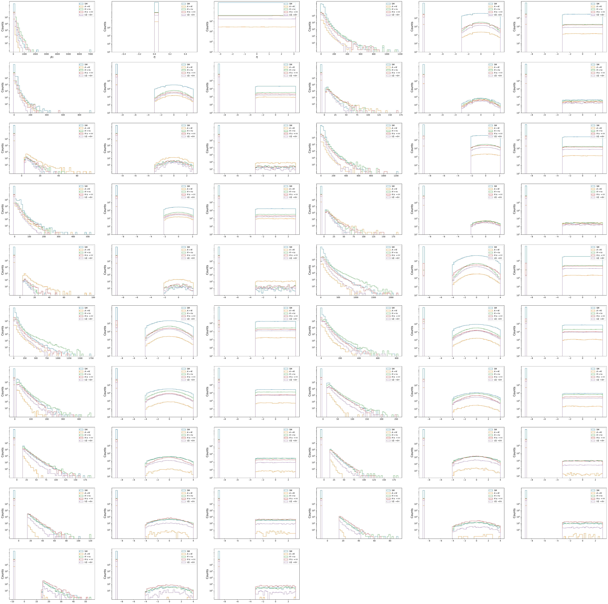
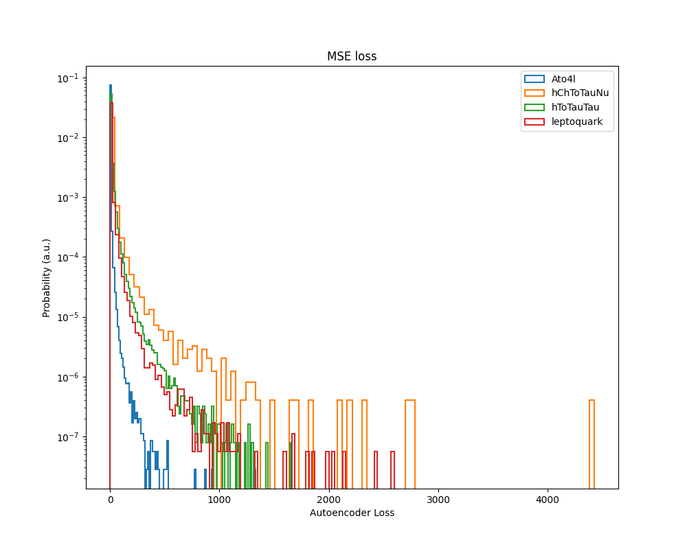
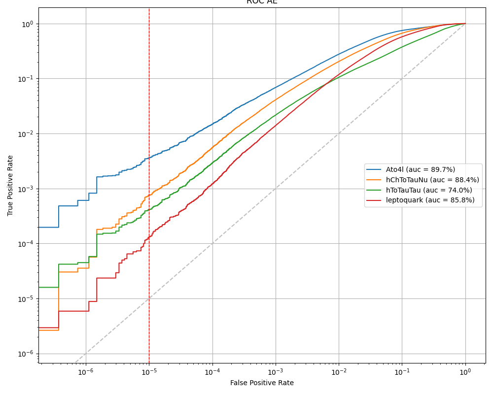

# Anomaly-Detection

## Dataset

### Standard Model Background

Processes:

- leptonic decays of inclusive W boson
- leptonic decays of inclusive Z boson
- top quark pair production
- QCD multijet production

### New Physics Signals
New Physics signals consists of four datasets:

|  |  |  |
|--|--|--|
| Signal | Mass (GeV) | Decay Channel |
| LeptoQuark (LQ) | 80 |  $$ LQ \rightarrow b \tau $$ |
| Neutral Scalar Boson (A) | 50 |  $$ A \rightarrow Z Z \rightarrow l^+ l^- l^+ l^- $$ |
| Scalar Boson (h^0) | 60 |  $$ h^0 \rightarrow \tau \tau $$ |
| Charged Scalar Boson (h^{\pm}) | 60 |  $$ h^0 \rightarrow \tau \nu $$ |

## Some results

## References/Datasets:

Dataset from https://mpp-hep.github.io/ADC2021/
Code Structure is motivated from https://github.com/mpp-hep/ADC2021-examplecode
